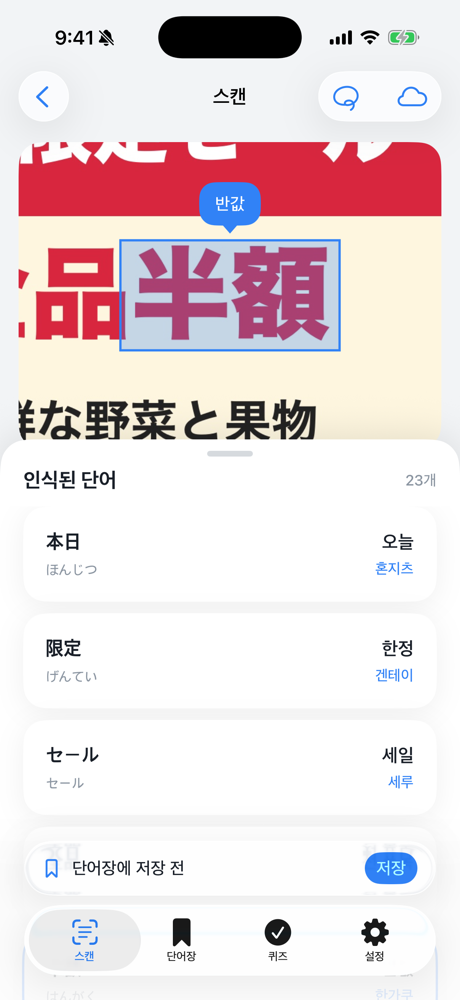
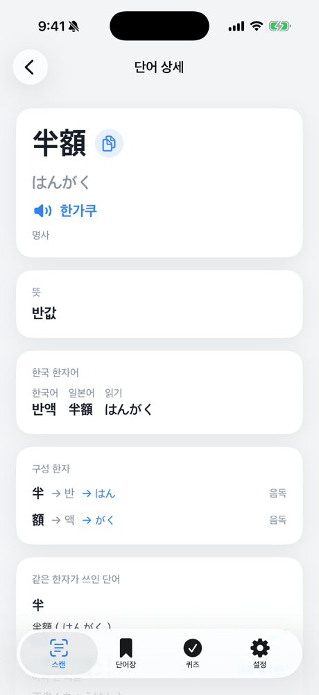
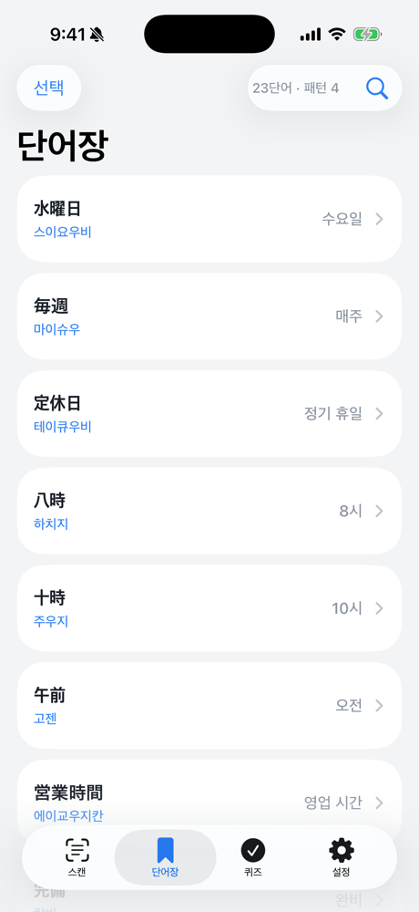
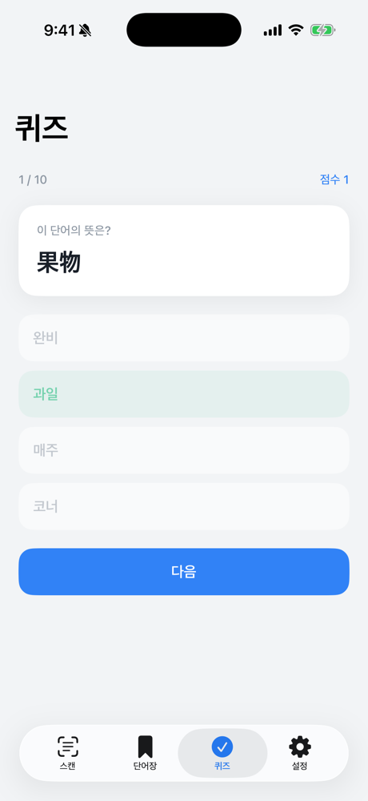

# Kanjiyomi

[](https://github.com/kut7728/Kanjiyomi/actions/workflows/test.yml)

한국어 | [日本語](README.ja.md)

일본 전단지·간판 사진 속 일본어를 단어 단위로 인식해, 뜻과 한글 발음을 보여 주는 iOS 앱입니다.
찍은 단어를 단어장에 모으고, 퀴즈와 한자 읽기 패턴으로 복습할 수 있습니다.

- SwiftUI · SwiftData · Vision · NaturalLanguage · Foundation Models
- iOS 18 이상 (온디바이스 AI·세로쓰기 문서 인식은 iOS 26 이상, 지원 기기에서만)
- 로그인 없음, 데이터는 모두 기기 안에 저장

| 스캔·하이라이트 | 단어 상세 | 단어장 | 퀴즈 |
|---|---|---|---|
|  |  |  |  |

## 주요 기능

- **스캔**: 카메라나 사진에서 텍스트를 인식하고 단어로 나눠, 뜻·읽기·한글 발음 목록을 보여 줍니다. 세로쓰기도 읽고, 직접 그린 영역만 잘라 인식할 수도 있습니다.
- **영역 하이라이트**: 목록에서 단어를 탭하면 사진 위 해당 위치에 박스와 말풍선이 뜨고, 말풍선을 탭하면 상세 화면으로 이동합니다.
- **상세**: 표기, 한국어 뜻, 한글 발음, 예문, 한자 읽기 패턴을 보여 줍니다. 단어장 저장은 사용자가 원할 때만 합니다.
- **단어장**: 저장한 단어를 조회하고 삭제(스와이프·일괄 선택)할 수 있습니다. 단어를 찍은 원본 사진으로 돌아갈 수 있고, 사전 검색도 여기서 합니다.
- **퀴즈**: 단어장으로 4지선다(단어→뜻, 뜻→단어)를 풉니다. 저장한 단어에서 뽑은 한자 읽기 패턴으로 처음 보는 단어의 읽기를 추론하는 문제도 있습니다.
- **스캔 기록**: 이전 스캔 결과를 다시 열어 볼 수 있습니다.

## 인식 파이프라인

```
사진 → OCR(Vision) → 단어 나누기 → 사전 조회(JMdict) → 한국어 뜻 생성(캐시) → 가나→한글 발음 변환
```

- **OCR**: iOS 26에서는 `RecognizeDocumentsRequest`로 세로쓰기까지 읽고, 그 이하에서는 `VNRecognizeTextRequest`를 씁니다.
- **단어 나누기**: 설정에서 세 가지 모드 중 하나를 고릅니다.
  | 모드 | 방식 | 네트워크 |
  |---|---|---|
  | 사전 | 번들 JMdict에 있는 단어 기준으로 나눔 | 없음 |
  | 온디바이스 AI | Foundation Models로 사전에 없는 고유명사·복합어까지 나눔 | 없음 |
  | ChatGPT | 사용자 본인의 OpenAI API 키로 나누기와 뜻 생성 | 있음 |
- **한국어 뜻**: 생성한 뜻은 SwiftData에 캐시해서, 한 번 본 단어는 모델을 다시 호출하지 않습니다. 생성을 못 하면 JMdict 영어 뜻으로 대신합니다.
- **한글 발음**: LLM을 쓰지 않고 가나→한글 매핑 테이블로 정해진 규칙대로 변환합니다.

## API 키와 개인정보

- 앱과 이 저장소에는 API 키가 들어 있지 않습니다. ChatGPT 모드는 사용자가 직접 입력한 키로만 동작합니다.
- 키는 Keychain에 `kSecAttrAccessibleWhenUnlockedThisDeviceOnly` 속성으로 저장되어, 다른 기기로 옮겨지지 않습니다. 저장 직후 화면 상태에서 평문을 지우고, 요청할 때마다 Keychain에서 읽어 HTTPS `Authorization` 헤더로만 보냅니다. URL이나 로그에는 남기지 않습니다.
- 기기 밖으로 나가는 데이터는 ChatGPT 모드에서 보내는 **인식된 텍스트**뿐입니다. 사진은 보내지 않습니다.

## 프로젝트 구조

```
Kanjiyomi/
├── Features/       # 화면 단위 (Scan, WordDetail, Vocabulary, Search, Quiz, Settings)
├── Services/       # OCR, 단어 나누기, 사전, 뜻 생성, OpenAI, Keychain
│   └── Kanji/      # 한자 추출, 음독·훈독 분류, 읽기 정렬, 패턴 감지, 추론 퀴즈 생성
├── Models/         # SwiftData 모델 (VocabWord, WordCache, ScanRecord …)
├── DesignSystem/   # 색·타이포·공통 컴포넌트
└── Resources/      # jmdict.sqlite (Git LFS)
tools/              # 사전 DB를 만드는 Python 스크립트
KanjiyomiTests/     # 가나 변환, 영역 선택, 한자 패턴 단위 테스트
```

## 빌드

1. Git LFS를 설치한 뒤 clone합니다. 사전 DB(`jmdict.sqlite`)는 LFS로 관리합니다.
   ```sh
   git lfs install
   git clone https://github.com/kut7728/Kanjiyomi.git
   ```
2. `Kanjiyomi.xcodeproj`를 열고, Signing에서 본인 Team을 선택한 뒤 실행합니다.

사전 DB를 직접 만들려면 다음을 실행합니다. EDRDG와 Unicode에서 원본 데이터를 내려받습니다.

```sh
python3 tools/build_dict.py          # JMdict → entries 테이블
python3 tools/build_kanji_layer.py   # KANJIDIC2 + Unihan → 한자 패턴 테이블
```

## 데이터 출처와 라이선스

- [JMdict](https://www.edrdg.org/wiki/index.php/JMdict-EDICT_Dictionary_Project), [KANJIDIC2](https://www.edrdg.org/wiki/index.php/KANJIDIC_Project): © Electronic Dictionary Research and Development Group. [CC BY-SA 4.0](https://creativecommons.org/licenses/by-sa/4.0/)에 따라 사용하며, 이 데이터로 만든 `jmdict.sqlite`도 같은 라이선스를 따릅니다.
- [Unihan Database](https://www.unicode.org/charts/unihan.html): © Unicode, Inc. [Unicode License](https://www.unicode.org/license.txt)에 따라 사용합니다.
